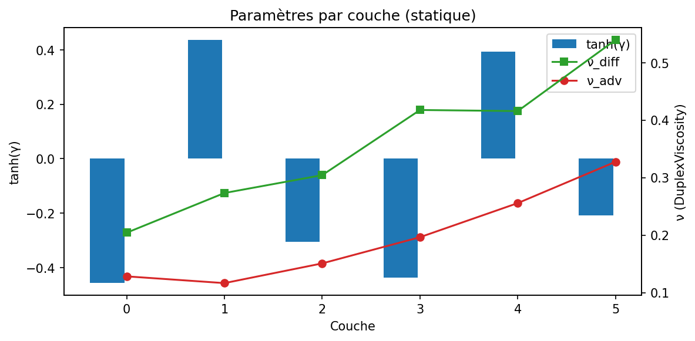
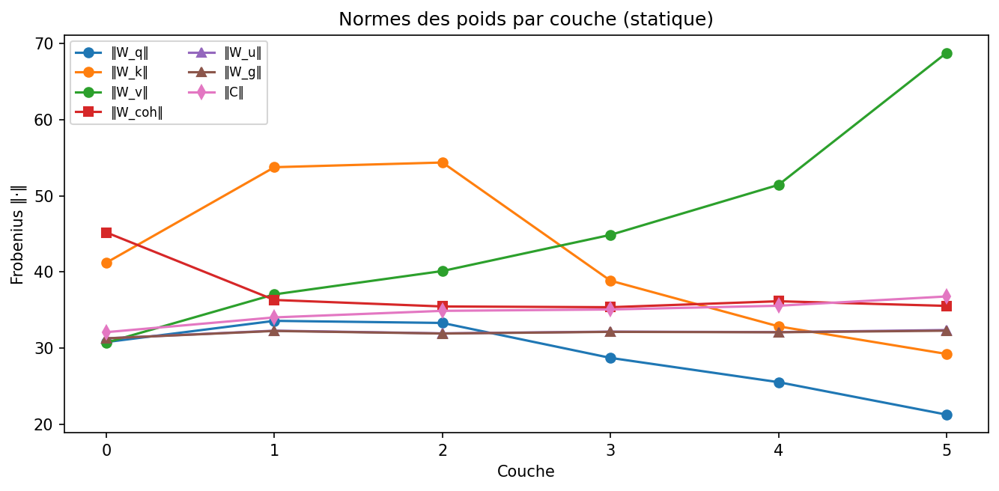
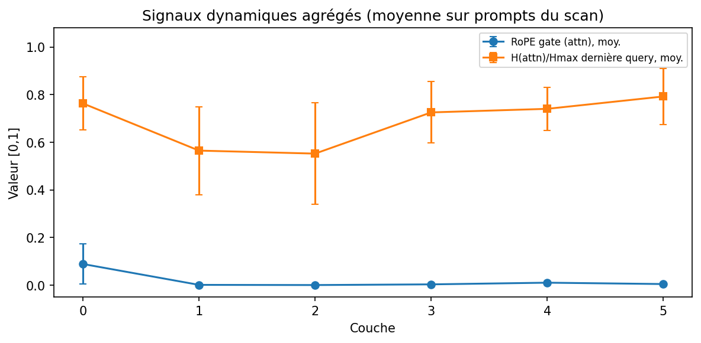
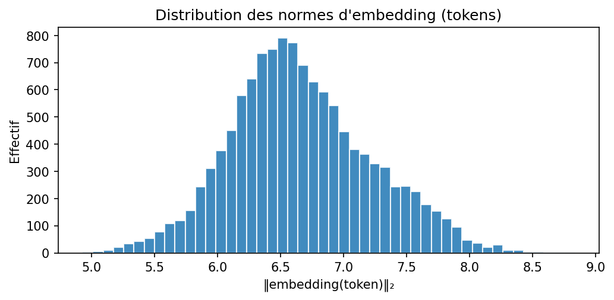
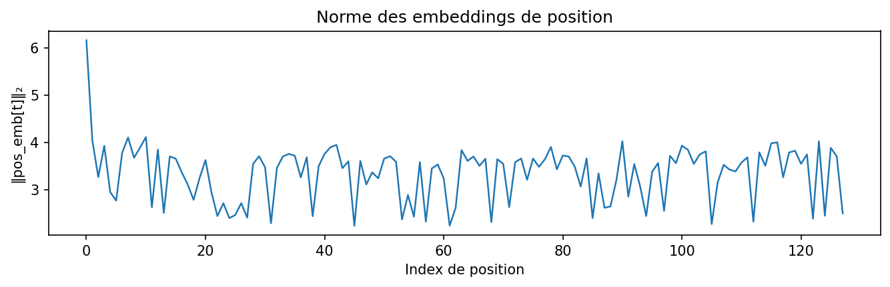
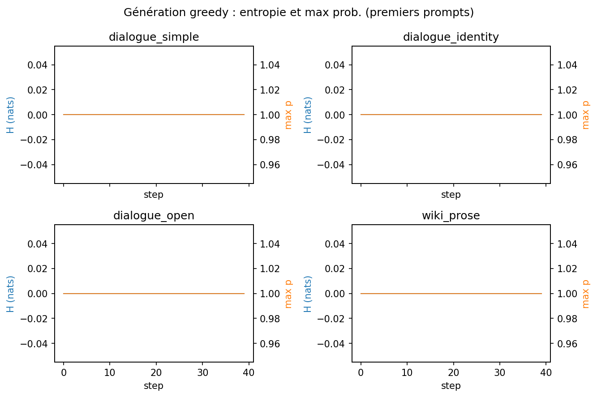

# Scan latent MIRA-L_chat — rapport détaillé

*Checkpoint principal* : `c:\Users\Utilisateur\Downloads\MIRAZOOM-main\MIRAZOOM-main\canal-global-lm\checkpoint\mira_glu_rope_v4_v3roles_ft_wiki02_ep3.pt`  |  epochs : 11
*Checkpoint de référence (base)* : *(aucun — scan principal seul)*
*Architecture* : D=256  L=6  H=8  seq_len=128  params=9,110,401

## 1. Analyse statique des poids

### 1.1 Embeddings de tokens

- Vocabulaire : **12,003** tokens, dimension **256**
- Norme moyenne des embeddings : **6.662** (std 0.560, min 4.930, max 8.834)
- Tokens quasi-morts (|emb| < 0.05) : **0**
- Distribution des poids : mean=-0.0002, std=0.4178

**Embeddings de position** (128 positions) :
- Norme moyenne : 3.342  (min 2.232, max 6.169)
- Cosine(pos[0], pos[-1]) = **-0.140**  (proche de 1 = positions peu differenciees, proche de 0 = bien separees)

### 1.2 Paramètres appris par couche

| Couche | γ | tanh(γ) | Saturé ? | ν_diff | ν_adv |
|--------|-------|---------|----------|--------|-------|
| 0 | -0.4934 | -0.4569 | **OUI** | +0.2043 | +0.1283 |
| 1 | +0.4678 | +0.4364 | non | +0.2733 | +0.1166 |
| 2 | -0.3155 | -0.3054 | non | +0.3044 | +0.1509 |
| 3 | -0.4687 | -0.4372 | non | +0.4177 | +0.1965 |
| 4 | +0.4162 | +0.3937 | non | +0.4158 | +0.2558 |
| 5 | -0.2119 | -0.2088 | non | +0.5396 | +0.3276 |

**Lecture** : pendant l'entraînement, |γ| est contraint par **gamma_clamp = 0.500** (saturé si |γ| ≥ 0.490). 
Si saturé, le biais de cohérence globale est proche du plafond (signal fort), sinon γ module plus finement.

### 1.3 Comparaison base vs fine-tuné

_Aucun checkpoint de base fourni — cette section est omise._

## 2. Analyse dynamique (forward pass par prompt)

### 2.x Prompt : `dialogue_simple`
> *'USER: bonjour\nMIRA: '*  (8 tokens)

- Norme moyenne apres embedding : 7.838
- Norme moyenne apres couche finale + LN : 23.031
- **Entropie du prochain token** : 4.000 (max=9.393, ratio=0.426)

**Par couche :**
| # | tanh(γ) | gate RoPE | ν | ‖attn‖ | ‖mlp‖ | ‖z_next‖ | H(attn) / Hmax |
|---|---------|-----------|------|--------|-------|----------|----------------|
| 0 | -0.457 | 0.031 | +0.217 | 12.98 | 8.85 | 7.84 | 0.676 |
| 1 | +0.436 | 0.000 | +0.273 | 17.77 | 10.52 | 8.68 | 0.581 |
| 2 | -0.305 | 0.000 | +0.384 | 21.55 | 9.45 | 9.96 | 0.534 |
| 3 | -0.437 | 0.001 | +0.490 | 21.57 | 15.86 | 12.06 | 0.684 |
| 4 | +0.394 | 0.015 | +0.491 | 25.33 | 21.07 | 15.62 | 0.771 |
| 5 | -0.209 | 0.007 | +0.739 | 43.36 | 37.12 | 19.15 | 0.749 |

**Top-10 prochains tokens :**
| Rang | Token | Prob |
|------|-------|------|
| 1 | `\n` | 0.241 |
| 2 | `),` | 0.208 |
| 3 | `` | 0.047 |
| 4 | `er` | 0.044 |
| 5 | `osc` | 0.024 |
| 6 | ` de` | 0.019 |
| 7 | `000` | 0.019 |
| 8 | ` d` | 0.016 |
| 9 | `--` | 0.013 |
| 10 | `..` | 0.009 |

### 2.x Prompt : `dialogue_identity`
> *"USER: Tu t'appelles comment ?\nMIRA: "*  (12 tokens)

- Norme moyenne apres embedding : 7.713
- Norme moyenne apres couche finale + LN : 23.131
- **Entropie du prochain token** : 4.686 (max=9.393, ratio=0.499)

**Par couche :**
| # | tanh(γ) | gate RoPE | ν | ‖attn‖ | ‖mlp‖ | ‖z_next‖ | H(attn) / Hmax |
|---|---------|-----------|------|--------|-------|----------|----------------|
| 0 | -0.457 | 0.026 | +0.228 | 12.34 | 9.46 | 7.56 | 0.689 |
| 1 | +0.436 | 0.000 | +0.229 | 17.75 | 9.88 | 8.43 | 0.510 |
| 2 | -0.305 | 0.000 | +0.367 | 21.75 | 10.57 | 9.63 | 0.473 |
| 3 | -0.437 | 0.002 | +0.432 | 21.75 | 15.98 | 11.51 | 0.650 |
| 4 | +0.394 | 0.014 | +0.448 | 27.01 | 22.80 | 15.21 | 0.682 |
| 5 | -0.209 | 0.004 | +0.649 | 47.61 | 38.37 | 20.21 | 0.691 |

**Top-10 prochains tokens :**
| Rang | Token | Prob |
|------|-------|------|
| 1 | `),` | 0.174 |
| 2 | `\n` | 0.079 |
| 3 | `er` | 0.063 |
| 4 | `000` | 0.045 |
| 5 | `’` | 0.041 |
| 6 | `` | 0.035 |
| 7 | `--` | 0.031 |
| 8 | `osc` | 0.021 |
| 9 | `use` | 0.017 |
| 10 | `00` | 0.015 |

### 2.x Prompt : `dialogue_open`
> *'USER: Que fais-tu dans la vie ?\nMIRA: '*  (14 tokens)

- Norme moyenne apres embedding : 7.535
- Norme moyenne apres couche finale + LN : 22.785
- **Entropie du prochain token** : 4.459 (max=9.393, ratio=0.475)

**Par couche :**
| # | tanh(γ) | gate RoPE | ν | ‖attn‖ | ‖mlp‖ | ‖z_next‖ | H(attn) / Hmax |
|---|---------|-----------|------|--------|-------|----------|----------------|
| 0 | -0.457 | 0.025 | +0.193 | 12.43 | 9.35 | 7.40 | 0.709 |
| 1 | +0.436 | 0.000 | +0.228 | 18.32 | 9.09 | 8.31 | 0.492 |
| 2 | -0.305 | 0.000 | +0.379 | 21.54 | 9.68 | 9.51 | 0.459 |
| 3 | -0.437 | 0.002 | +0.459 | 21.53 | 14.53 | 11.33 | 0.660 |
| 4 | +0.394 | 0.010 | +0.489 | 26.82 | 18.92 | 14.53 | 0.654 |
| 5 | -0.209 | 0.007 | +0.632 | 46.96 | 36.18 | 19.28 | 0.720 |

**Top-10 prochains tokens :**
| Rang | Token | Prob |
|------|-------|------|
| 1 | `),` | 0.180 |
| 2 | `\n` | 0.140 |
| 3 | `er` | 0.058 |
| 4 | `--` | 0.040 |
| 5 | `` | 0.034 |
| 6 | `ol` | 0.033 |
| 7 | `000` | 0.030 |
| 8 | `..` | 0.020 |
| 9 | `00` | 0.019 |
| 10 | `osc` | 0.014 |

### 2.x Prompt : `wiki_prose`
> *'Le Japon est un archipel situe'*  (10 tokens)

- Norme moyenne apres embedding : 7.576
- Norme moyenne apres couche finale + LN : 21.403
- **Entropie du prochain token** : 3.507 (max=9.393, ratio=0.373)

**Par couche :**
| # | tanh(γ) | gate RoPE | ν | ‖attn‖ | ‖mlp‖ | ‖z_next‖ | H(attn) / Hmax |
|---|---------|-----------|------|--------|-------|----------|----------------|
| 0 | -0.457 | 0.107 | +0.185 | 12.11 | 9.23 | 7.34 | 0.798 |
| 1 | +0.436 | 0.000 | +0.227 | 17.94 | 8.77 | 7.91 | 0.344 |
| 2 | -0.305 | 0.000 | +0.373 | 22.60 | 10.53 | 9.35 | 0.293 |
| 3 | -0.437 | 0.001 | +0.455 | 21.93 | 14.11 | 11.53 | 0.779 |
| 4 | +0.394 | 0.006 | +0.483 | 25.15 | 19.28 | 14.88 | 0.765 |
| 5 | -0.209 | 0.003 | +0.672 | 40.20 | 28.25 | 17.88 | 0.811 |

**Top-10 prochains tokens :**
| Rang | Token | Prob |
|------|-------|------|
| 1 | ` l` | 0.195 |
| 2 | ` le` | 0.146 |
| 3 | ` la` | 0.132 |
| 4 | ` une` | 0.059 |
| 5 | ` à` | 0.041 |
| 6 | ` un` | 0.041 |
| 7 | ` dans` | 0.031 |
| 8 | ` sa` | 0.026 |
| 9 | ` en` | 0.024 |
| 10 | `,` | 0.021 |

### 2.x Prompt : `oob_repetitions`
> *'aaaaaaaa'*  (8 tokens)

- Norme moyenne apres embedding : 6.708
- Norme moyenne apres couche finale + LN : 17.531
- **Entropie du prochain token** : 3.330 (max=9.393, ratio=0.355)

**Par couche :**
| # | tanh(γ) | gate RoPE | ν | ‖attn‖ | ‖mlp‖ | ‖z_next‖ | H(attn) / Hmax |
|---|---------|-----------|------|--------|-------|----------|----------------|
| 0 | -0.457 | 0.170 | +0.186 | 13.71 | 7.44 | 6.76 | 0.863 |
| 1 | +0.436 | 0.006 | +0.232 | 18.66 | 8.38 | 7.14 | 0.691 |
| 2 | -0.305 | 0.001 | +0.410 | 22.73 | 11.53 | 9.41 | 0.829 |
| 3 | -0.437 | 0.007 | +0.532 | 25.58 | 12.62 | 12.18 | 0.910 |
| 4 | +0.394 | 0.005 | +0.559 | 23.01 | 10.30 | 14.12 | 0.910 |
| 5 | -0.209 | 0.002 | +0.682 | 50.80 | 37.28 | 21.30 | 0.969 |

**Top-10 prochains tokens :**
| Rang | Token | Prob |
|------|-------|------|
| 1 | `a` | 0.496 |
| 2 | `,` | 0.052 |
| 3 | `o` | 0.045 |
| 4 | ` (` | 0.026 |
| 5 | `.` | 0.019 |
| 6 | ` a` | 0.015 |
| 7 | ` et` | 0.014 |
| 8 | ` P` | 0.007 |
| 9 | ` de` | 0.006 |
| 10 | ` M` | 0.006 |

### 2.x Prompt : `oob_numbers`
> *'012345'*  (4 tokens)

- Norme moyenne apres embedding : 7.235
- Norme moyenne apres couche finale + LN : 15.401
- **Entropie du prochain token** : 4.857 (max=9.393, ratio=0.517)

**Par couche :**
| # | tanh(γ) | gate RoPE | ν | ‖attn‖ | ‖mlp‖ | ‖z_next‖ | H(attn) / Hmax |
|---|---------|-----------|------|--------|-------|----------|----------------|
| 0 | -0.457 | 0.250 | +0.237 | 14.93 | 9.12 | 7.82 | 0.971 |
| 1 | +0.436 | 0.000 | +0.257 | 18.82 | 10.17 | 8.65 | 0.937 |
| 2 | -0.305 | 0.000 | +0.392 | 24.10 | 12.98 | 10.46 | 0.908 |
| 3 | -0.437 | 0.008 | +0.443 | 26.43 | 18.59 | 14.30 | 0.877 |
| 4 | +0.394 | 0.009 | +0.534 | 20.93 | 13.85 | 16.80 | 0.779 |
| 5 | -0.209 | 0.002 | +0.666 | 40.57 | 47.49 | 23.46 | 0.957 |

**Top-10 prochains tokens :**
| Rang | Token | Prob |
|------|-------|------|
| 1 | `)` | 0.136 |
| 2 | `,` | 0.085 |
| 3 | `-` | 0.066 |
| 4 | `.` | 0.050 |
| 5 | `).` | 0.042 |
| 6 | `),` | 0.030 |
| 7 | ` (` | 0.024 |
| 8 | ` à` | 0.023 |
| 9 | ` :` | 0.022 |
| 10 | `4` | 0.019 |

### 2.x Prompt : `long_turn`
> *"USER: J'ai besoin d'aide pour rediger un email a mon collegue. Il a perdu son pere.\nMIRA: "*  (33 tokens)

- Norme moyenne apres embedding : 7.269
- Norme moyenne apres couche finale + LN : 21.343
- **Entropie du prochain token** : 4.137 (max=9.393, ratio=0.440)

**Par couche :**
| # | tanh(γ) | gate RoPE | ν | ‖attn‖ | ‖mlp‖ | ‖z_next‖ | H(attn) / Hmax |
|---|---------|-----------|------|--------|-------|----------|----------------|
| 0 | -0.457 | 0.011 | +0.156 | 11.53 | 8.54 | 6.97 | 0.633 |
| 1 | +0.436 | 0.000 | +0.190 | 17.44 | 7.69 | 7.74 | 0.399 |
| 2 | -0.305 | 0.000 | +0.322 | 21.64 | 9.38 | 9.06 | 0.369 |
| 3 | -0.437 | 0.001 | +0.398 | 21.14 | 12.99 | 10.74 | 0.515 |
| 4 | +0.394 | 0.011 | +0.421 | 25.49 | 17.21 | 13.80 | 0.620 |
| 5 | -0.209 | 0.006 | +0.582 | 46.31 | 32.96 | 19.33 | 0.648 |

**Top-10 prochains tokens :**
| Rang | Token | Prob |
|------|-------|------|
| 1 | `\n` | 0.282 |
| 2 | `--` | 0.102 |
| 3 | `er` | 0.046 |
| 4 | `osc` | 0.039 |
| 5 | `os` | 0.030 |
| 6 | `` | 0.028 |
| 7 | `espère` | 0.021 |
| 8 | `),` | 0.021 |
| 9 | `ous` | 0.019 |
| 10 | `..` | 0.019 |

## 3. Voisinage des embeddings de tokens clés

Top-8 voisins en cosine similarity, pour detecter les embeddings collapsés (qui expliqueraient les boucles de type 'je moi je moi').

### Token `'USER'` (id=685)
| Rang | Voisin | Similarité |
|------|--------|------------|
| 1 | ` revenir` | 0.265 |
| 2 | `timité` | 0.226 |
| 3 | ` capter` | 0.222 |
| 4 | `outes` | 0.212 |
| 5 | `enti` | 0.211 |
| 6 | ` scénarios` | 0.207 |
| 7 | `éléments` | 0.202 |
| 8 | `cheter` | 0.201 |

### Token `'MIRA'` (id=623)
| Rang | Voisin | Similarité |
|------|--------|------------|
| 1 | ` Mag` | 0.259 |
| 2 | ` lire` | 0.215 |
| 3 | `lème` | 0.209 |
| 4 | `MA` | 0.209 |
| 5 | `oy` | 0.208 |
| 6 | `;` | 0.207 |
| 7 | ` dirait` | 0.201 |
| 8 | ` mycologie` | 0.196 |

### Token `' MIRA'` (id=623)
| Rang | Voisin | Similarité |
|------|--------|------------|
| 1 | ` Mag` | 0.259 |
| 2 | ` lire` | 0.215 |
| 3 | `lème` | 0.209 |
| 4 | `MA` | 0.209 |
| 5 | `oy` | 0.208 |
| 6 | `;` | 0.207 |
| 7 | ` dirait` | 0.201 |
| 8 | ` mycologie` | 0.196 |

### Token `' MIRAZOOM'` (id=3331)
| Rang | Voisin | Similarité |
|------|--------|------------|
| 1 | ` éducative` | 0.240 |
| 2 | ` linguis` | 0.223 |
| 3 | ` identité` | 0.215 |
| 4 | ` photograph` | 0.209 |
| 5 | ` spéléologie` | 0.205 |
| 6 | ` éducation` | 0.205 |
| 7 | ` invisibles` | 0.205 |
| 8 | ` pleinement` | 0.203 |

### Token `'bonjour'` (id=997)
| Rang | Voisin | Similarité |
|------|--------|------------|
| 1 | ` excellent` | 0.383 |
| 2 | ` Bon` | 0.366 |
| 3 | ` mauvais` | 0.357 |
| 4 | ` bons` | 0.270 |
| 5 | ` meilleur` | 0.246 |
| 6 | ` mauvaise` | 0.246 |
| 7 | ` Rien` | 0.243 |
| 8 | ` suffit` | 0.240 |

### Token `' bonjour'` (id=997)
| Rang | Voisin | Similarité |
|------|--------|------------|
| 1 | ` excellent` | 0.383 |
| 2 | ` Bon` | 0.366 |
| 3 | ` mauvais` | 0.357 |
| 4 | ` bons` | 0.270 |
| 5 | ` meilleur` | 0.246 |
| 6 | ` mauvaise` | 0.246 |
| 7 | ` Rien` | 0.243 |
| 8 | ` suffit` | 0.240 |

### Token `' Bonjour'` (id=747)
| Rang | Voisin | Similarité |
|------|--------|------------|
| 1 | ` Salut` | 0.398 |
| 2 | ` équilibrés` | 0.238 |
| 3 | ` sage` | 0.234 |
| 4 | `hat` | 0.227 |
| 5 | ` restaurant` | 0.227 |
| 6 | `moi` | 0.227 |
| 7 | ` Certainement` | 0.220 |
| 8 | ` invité` | 0.216 |

### Token `'je'` (id=500)
| Rang | Voisin | Similarité |
|------|--------|------------|
| 1 | ` Je` | 0.453 |
| 2 | ` sculp` | 0.266 |
| 3 | ` tu` | 0.257 |
| 4 | `Je` | 0.255 |
| 5 | `je` | 0.253 |
| 6 | ` lis` | 0.232 |
| 7 | ` dess` | 0.229 |
| 8 | ` plong` | 0.225 |

### Token `' je'` (id=500)
| Rang | Voisin | Similarité |
|------|--------|------------|
| 1 | ` Je` | 0.453 |
| 2 | ` sculp` | 0.266 |
| 3 | ` tu` | 0.257 |
| 4 | `Je` | 0.255 |
| 5 | `je` | 0.253 |
| 6 | ` lis` | 0.232 |
| 7 | ` dess` | 0.229 |
| 8 | ` plong` | 0.225 |

### Token `' moi'` (id=992)
| Rang | Voisin | Similarité |
|------|--------|------------|
| 1 | ` Moi` | 0.299 |
| 2 | ` elles` | 0.230 |
| 3 | ` différente` | 0.229 |
| 4 | ` eux` | 0.222 |
| 5 | ` ba` | 0.220 |
| 6 | ` voilà` | 0.213 |
| 7 | `elles` | 0.212 |
| 8 | `moi` | 0.211 |

### Token `' tu'` (id=578)
| Rang | Voisin | Similarité |
|------|--------|------------|
| 1 | ` Tu` | 0.335 |
| 2 | `Tu` | 0.276 |
| 3 | ` je` | 0.257 |
| 4 | ` contac` | 0.254 |
| 5 | ` muscles` | 0.247 |
| 6 | ` bless` | 0.234 |
| 7 | ` protec` | 0.225 |
| 8 | ` Compos` | 0.221 |

### Token `' ma'` (id=953)
| Rang | Voisin | Similarité |
|------|--------|------------|
| 1 | ` Ma` | 0.361 |
| 2 | ` ta` | 0.324 |
| 3 | ` qua` | 0.278 |
| 4 | ` sa` | 0.268 |
| 5 | ` notre` | 0.236 |
| 6 | ` Sa` | 0.233 |
| 7 | ` Leur` | 0.221 |
| 8 | ` cét` | 0.213 |

### Token `' ton'` (id=846)
| Rang | Voisin | Similarité |
|------|--------|------------|
| 1 | ` son` | 0.371 |
| 2 | ` Son` | 0.336 |
| 3 | ` votre` | 0.331 |
| 4 | ` vos` | 0.321 |
| 5 | ` mon` | 0.263 |
| 6 | ` notre` | 0.259 |
| 7 | ` grammatic` | 0.249 |
| 8 | ` manière` | 0.245 |

### Token `'oui'` (id=1593)
| Rang | Voisin | Similarité |
|------|--------|------------|
| 1 | ` viol` | 0.263 |
| 2 | ` fidèles` | 0.249 |
| 3 | ` plaît` | 0.240 |
| 4 | `istes` | 0.234 |
| 5 | ` parti` | 0.232 |
| 6 | ` Oui` | 0.225 |
| 7 | ` plaire` | 0.221 |
| 8 | `athique` | 0.217 |

### Token `' oui'` (id=1593)
| Rang | Voisin | Similarité |
|------|--------|------------|
| 1 | ` viol` | 0.263 |
| 2 | ` fidèles` | 0.249 |
| 3 | ` plaît` | 0.240 |
| 4 | `istes` | 0.234 |
| 5 | ` parti` | 0.232 |
| 6 | ` Oui` | 0.225 |
| 7 | ` plaire` | 0.221 |
| 8 | `athique` | 0.217 |

### Token `' non'` (id=1445)
| Rang | Voisin | Similarité |
|------|--------|------------|
| 1 | ` quasi` | 0.305 |
| 2 | ` Non` | 0.296 |
| 3 | ` �` | 0.228 |
| 4 | ` potentiellement` | 0.223 |
| 5 | ` pleinement` | 0.222 |
| 6 | ` mutuellement` | 0.222 |
| 7 | ` voire` | 0.220 |
| 8 | ` jamais` | 0.219 |

### Token `'mapuche'` (id=452)
| Rang | Voisin | Similarité |
|------|--------|------------|
| 1 | `m` | 0.297 |
| 2 | ` M` | 0.261 |
| 3 | ` pair` | 0.224 |
| 4 | `jourd` | 0.223 |
| 5 | ` po` | 0.197 |
| 6 | `` | 0.196 |
| 7 | ` me` | 0.195 |
| 8 | ` quoi` | 0.190 |

### Token `' mapuche'` (id=452)
| Rang | Voisin | Similarité |
|------|--------|------------|
| 1 | `m` | 0.297 |
| 2 | ` M` | 0.261 |
| 3 | ` pair` | 0.224 |
| 4 | `jourd` | 0.223 |
| 5 | ` po` | 0.197 |
| 6 | `` | 0.196 |
| 7 | ` me` | 0.195 |
| 8 | ` quoi` | 0.190 |

### Token `' Wikipedia'` (id=2572)
| Rang | Voisin | Similarité |
|------|--------|------------|
| 1 | `W` | 0.582 |
| 2 | ` w` | 0.399 |
| 3 | `w` | 0.260 |
| 4 | ` We` | 0.236 |
| 5 | ` Pouvons` | 0.229 |
| 6 | ` Sch` | 0.228 |
| 7 | `Re` | 0.214 |
| 8 | `�` | 0.214 |

**Anisotropie globale (echantillon 2000 tokens)** : similarite cosinus moyenne = **0.007**
*proche de 0 = embeddings bien distribues ; proche de 1 = embeddings collapses (anisotropie forte, typique de modeles pre-entraines)*

## 4. Dynamique de génération (token par token)

### Prompt : `dialogue_simple`
> *'USER: bonjour\nMIRA: '*

**Mode greedy (top-1, temp=1.0)** :
```


 Le Mercure est un genre de plantes de type type. Il est principalement causé par les plantes et les plantes herbacées. Il est également connu pour son habitat et
```
- Premiers tokens à très basse entropie (<0.5) : step 0
- Steps avec max_prob > 0.8 (décision très confiante) : 40/40
- Entropie moyenne : 0.000  (min -0.000, max -0.000)

**Mode sample (temp=0.55, top-k=40)** — identique au chat :
```


 Le Mercure est un genre de plantes de type type. Il est principalement causé par les plantes et les plantes herbacées. Il est également connu pour son habitat et
```

### Prompt : `dialogue_identity`
> *"USER: Tu t'appelles comment ?\nMIRA: "*

**Mode greedy (top-1, temp=1.0)** :
```
), est un film français réalisé par Jean-Paul Sartre, sorti en 1968. Il y a aussi des scènes de guerre et de guerre, dont la série est très populaire.
```
- Premiers tokens à très basse entropie (<0.5) : step 0
- Steps avec max_prob > 0.8 (décision très confiante) : 40/40
- Entropie moyenne : 0.000  (min -0.000, max -0.000)

**Mode sample (temp=0.55, top-k=40)** — identique au chat :
```
), est un film français réalisé par Jean-Paul Sartre, sorti en 1968. Il y a aussi des scènes de guerre et de guerre, dont la série est très populaire.
```

### Prompt : `dialogue_open`
> *'USER: Que fais-tu dans la vie ?\nMIRA: '*

**Mode greedy (top-1, temp=1.0)** :
```
), est un sport qui combine fitness cardio et forme physique. Il peut être bénéfique de faire du sport régulièrement. C'est une excellente idée, merci Mira ! J'apprécie beaucoup ces conseils.
```
- Premiers tokens à très basse entropie (<0.5) : step 0
- Steps avec max_prob > 0.8 (décision très confiante) : 40/40
- Entropie moyenne : 0.000  (min -0.000, max -0.000)

**Mode sample (temp=0.55, top-k=40)** — identique au chat :
```
), est un sport qui combine fitness cardio et forme physique. Il peut être bénéfique de faire du sport régulièrement. C'est une excellente idée, merci Mira ! J'apprécie beaucoup ces conseils.
```

### Prompt : `wiki_prose`
> *'Le Japon est un archipel situe'*

**Mode greedy (top-1, temp=1.0)** :
```
 l'île de Tokyo. Le Japon est un pays d'Europe occidentale dont la capitale est Paris. Le territoire français métropolitain s'étend de la mer
```
- Premiers tokens à très basse entropie (<0.5) : step 0
- Steps avec max_prob > 0.8 (décision très confiante) : 40/40
- Entropie moyenne : 0.000  (min -0.000, max -0.000)

**Mode sample (temp=0.55, top-k=40)** — identique au chat :
```
 l'île de Tokyo. Le Japon est un pays d'Europe occidentale dont la capitale est Paris. Le territoire français métropolitain s'étend de la mer
```

### Prompt : `oob_repetitions`
> *'aaaaaaaa'*

**Mode greedy (top-1, temp=1.0)** :
```
aaaaaaaaaaaaaaaaaaaaaaaaaaaaaaaaaaaaaaaa
```
- Premiers tokens à très basse entropie (<0.5) : step 0
- Steps avec max_prob > 0.8 (décision très confiante) : 40/40
- Entropie moyenne : 0.000  (min -0.000, max -0.000)

**Mode sample (temp=0.55, top-k=40)** — identique au chat :
```
aaaaaaaaaaaaaaaaaaaaaaaaaaaaaaaaaaaaaaaa
```

### Prompt : `oob_numbers`
> *'012345'*

**Mode greedy (top-1, temp=1.0)** :
```
) : le premier empereur romain d'Occident () : le premier empereur romain d'Occident () : le premier empereur romain d'Occident ()
```
- Premiers tokens à très basse entropie (<0.5) : step 0
- Steps avec max_prob > 0.8 (décision très confiante) : 40/40
- Entropie moyenne : 0.000  (min -0.000, max -0.000)

**Mode sample (temp=0.55, top-k=40)** — identique au chat :
```
) : le premier empereur romain d'Occident () : le premier empereur romain d'Occident () : le premier empereur romain d'Occident ()
```

### Prompt : `long_turn`
> *"USER: J'ai besoin d'aide pour rediger un email a mon collegue. Il a perdu son pe"*

**Mode greedy (top-1, temp=1.0)** :
```


 Le Mercosur est un pays d'Europe occidentale dont la capitale est Paris. Le territoire français métropolitain s'étend de la mer Méditerran
```
- Premiers tokens à très basse entropie (<0.5) : step 0
- Steps avec max_prob > 0.8 (décision très confiante) : 40/40
- Entropie moyenne : 0.000  (min -0.000, max -0.000)

**Mode sample (temp=0.55, top-k=40)** — identique au chat :
```


 Le Mercosur est un pays d'Europe occidentale dont la capitale est Paris. Le territoire français métropolitain s'étend de la mer Méditerran
```

## 5. Interprétation synthétique

### Signaux de santé

- Couches avec γ proche du clamp (**gamma_clamp=0.500**) : **1/6**  → si plusieurs, le biais global est proche du plafond (indicateur possible que le modèle compense fortement via la cohérence globale).
- Entropie d'attention moyenne (dernière position) sur tous prompts & couches : **0.689** du max  → proche de 0 = attention très focalisée, proche de 1 = attention diffuse.
- Anisotropie embeddings : 0.007  (faible (sain))

## 6. Figures (matplotlib)

### 6.1 γ et ν par couche



### 6.2 Normes de poids par couche



### 6.3 Dynamique agrégée (tous les prompts)



### 6.4 Histogramme des normes d'embedding



### 6.5 Norme des embeddings de position



### 6.6 Génération greedy (H et max_p)



_Les barres d'erreur (graphique 6.3) = écart-type entre les prompts du scan._
